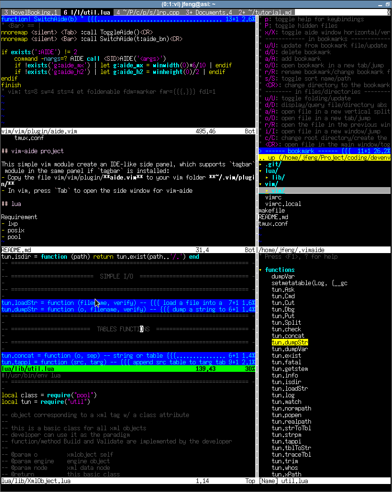

# devenv

Personal settings, probably not for public consumption.\
It is not necessary to git clone the whole repository.
Just copy invidual file to meet your need.

    ▼ lua/
      ▼ lib/
        gem.lua
        lom.lua
        util.lua
        XmlObject.lua
    ▼ vim/
      ▼ vim/
        ▼ autoload/
        ▼ doc/
        ▼ plugin/
          aide.vim
        ▼ syntax/
          xml.vim
      vimrc
      vimrc.local
    makefile
    README.md
    tmux.conf

## vim-aide project

This simple vim module create an IDE-like side panel, which supports `tagbar` module in the same panel if `tagbar` is installed:
- Copy the file vim/vim/plugin/**aide.vim** to your vim folder **~/.vim/plugin/**
- In vim, press `Tab` to open the side window for vim-aide

## lua

### Requirement

- lxp
- posix
- pool

### Lua XML Table (LXT)

lxt.lua provide a simple x/html parser to LXT format.

**Example.1**

    lxt = require('lxt')
    lxt.ParseXml('file.xhtml', 0)
    lxt.ParseXml('file.xhtml', 1) -- clean end space
    lxt.ParseXml('file.xhtml', 2) -- clean space @ both ends
    lxt.ParseXml('file.html', 3)
    lxt.ParseXml('file.html', 4)  -- clean end space
    lxt.ParseXml('file.html', 5)  -- clean space @ both ends
